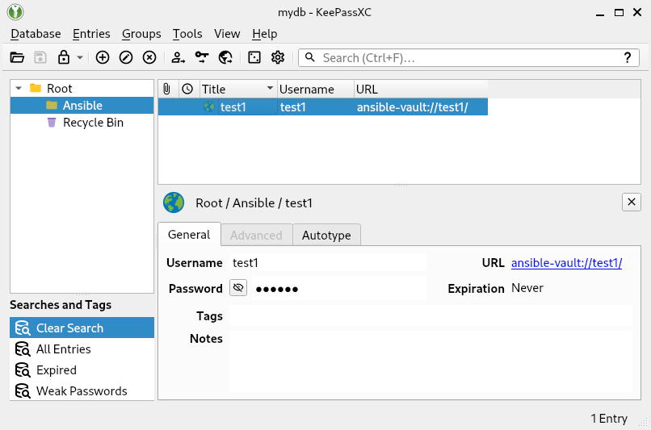

# Ansible Vault client for KeePassXC

`vault-keepassxc-client` is a [client script for Ansible
Vault][ansible-vault-client-scripts] to work with
[KeePassXC][keepassxc]
([keepassxreboot/keepassxc][keepassxc-github]).
Passwords for vaults are retrieved from the password manager.

To remain a tiny tool [F. Zhang's `git-credential-keepassxc`
program][git-credential-keepassxc] is used. It uses KeePassXC's socket
protocol, originally written for web browser extensions.

## Usage

The client can be registered for individual vault IDs in `ansible.cfg`:

```ini
[defaults]
vault_identity_list = test1@/usr/local/bin/vault-keepassxc-client
```

The Git credential client needs to be configured
([documentation][git-credential-keepassxc-config]; caller limitations are left
as an exercise to the reader):

```shell
git-credential-keepassxc configure
```

Password entries in KeePassXC are recognized via URLs of the form
`ansible-vault://<vault_id>/`. They need to be in a group named `Ansible`. Such
entries can be configured manually or via the command line. Without
`--generate-random` the user is prompted for the password.

Example:

```shell
$ vault-keepassxc-client --vault-id test1 --generate-random --set
```

Read the password back:

```shell
$ vault-keepassxc-client --vault-id test1 --get
AbXy[…]1234
```



[ansible-vault-client-scripts]: https://docs.ansible.com/ansible/latest/vault_guide/vault_managing_passwords.html#storing-passwords-in-third-party-tools-with-vault-password-client-scripts
[keepassxc]: https://keepassxc.org/
[keepassxc-github]: https://github.com/keepassxreboot/keepassxc
[keepassxc-protocol]: https://github.com/keepassxreboot/keepassxc-browser/blob/develop/keepassxc-protocol.md
[git-credential-keepassxc]: https://github.com/Frederick888/git-credential-keepassxc
[git-credential-keepassxc-config]: https://github.com/Frederick888/git-credential-keepassxc?tab=readme-ov-file#configuration

<!-- vim: set sw=2 sts=2 et : -->
